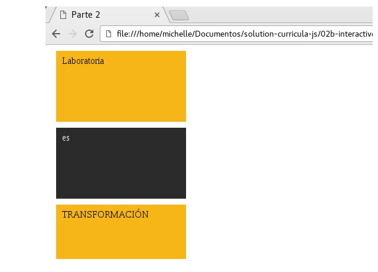

## DISPLAY DOS
1. OBJETIVO
-Replica las siguientes vistas poniendo en práctica tus conocimientos de display.

2. DESCRIPCION
-Este proyecto contiene una bandera utilizando display en bloque

3. HERRAMIENTAS
- HTML5 & CSS3 
